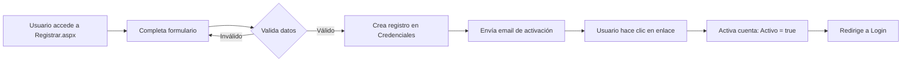
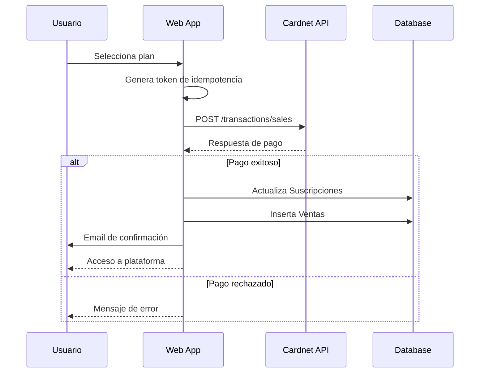

# 🏢 MiGente En Línea

<div align="center">


**Plataforma integral para la gestión de relaciones laborales en República Dominicana**

[Características](#-características-principales) • [Instalación](#-instalación) • [Arquitectura](#-arquitectura-técnica) • [Documentación](#-documentación) • [Licencia](#-licencia)

</div>

---

## 📋 Índice

- [Descripción General](#-descripción-general)
- [Características Principales](#-características-principales)
- [Arquitectura Técnica](#-arquitectura-técnica)
- [Requisitos del Sistema](#-requisitos-del-sistema)
- [Instalación](#-instalación)
- [Configuración](#-configuración)
- [Estructura del Proyecto](#-estructura-del-proyecto)
- [Flujos de Trabajo Críticos](#-flujos-de-trabajo-críticos)
- [Roles de Usuario](#-roles-de-usuario)
- [Integraciones](#-integraciones)
- [Seguridad](#-seguridad)
- [Desarrollo](#-desarrollo)
- [Despliegue](#-despliegue)
- [Contribución](#-contribución)
- [Licencia](#-licencia)
- [Contacto](#-contacto)

---

## 🎯 Descripción General

**MiGente En Línea** es una aplicación web empresarial construida con ASP.NET Web Forms que facilita la gestión integral de relaciones laborales en República Dominicana. La plataforma conecta **Empleadores** con **Contratistas/Proveedores de Servicios**, permitiendo:

- ✅ Gestión completa de nómina y empleados
- 📄 Generación automática de contratos y recibos de pago
- 💳 Procesamiento de pagos de suscripciones vía Cardnet
- 🤖 Asistente legal virtual con IA (OpenAI)
- 📊 Cumplimiento con normativas dominicanas (TSS, padrón nacional)
- ⭐ Sistema de calificaciones para contratistas

---

## ✨ Características Principales

### Para Empleadores
- 👥 **Gestión de Empleados**: Registro completo de colaboradores (fijos y temporales)
- 💰 **Sistema de Nómina**: Cálculo automático de salarios, deducciones TSS y prestaciones
- 📑 **Generación de Documentos**: Contratos, recibos de pago, descargas automáticas en PDF
- 🔍 **Búsqueda de Contratistas**: Explorar perfiles de proveedores de servicios
- ⭐ **Sistema de Calificación**: Evaluar el desempeño de contratistas
- 📧 **Notificaciones por Email**: Confirmaciones, recordatorios y documentos

### Para Contratistas
- 🎨 **Perfil Profesional**: Exhibir servicios, experiencia y portafolio
- 📸 **Galería de Trabajos**: Mostrar proyectos realizados
- 💬 **Gestión de Calificaciones**: Ver y responder reseñas de empleadores
- 💳 **Planes de Suscripción**: Acceso flexible según necesidades

### Generales
- 🔐 **Autenticación Segura**: Forms Authentication con validación por email
- 💳 **Pagos Integrados**: Procesamiento con Cardnet (gateway dominicano)
- 🤖 **Abogado Virtual**: Asistencia legal automatizada con IA
- 📱 **Diseño Responsivo**: Compatible con dispositivos móviles
- 🇩🇴 **Contexto Local**: Adaptado a leyes y regulaciones dominicanas

---

## 🏗️ Arquitectura Técnica

### Stack Tecnológico

```
┌─────────────────────────────────────────────────────────────┐
│                    PRESENTACIÓN                             │
│  ASP.NET Web Forms + DevExpress v23.1 + Bootstrap          │
└─────────────────────────────────────────────────────────────┘
                            │
┌─────────────────────────────────────────────────────────────┐
│                   LÓGICA DE NEGOCIO                         │
│  Services Layer (C#) + SOAP Web Services (.asmx)           │
└─────────────────────────────────────────────────────────────┘
                            │
┌─────────────────────────────────────────────────────────────┐
│                  ACCESO A DATOS                             │
│         Entity Framework 6 (Database-First)                 │
└─────────────────────────────────────────────────────────────┘
                            │
┌─────────────────────────────────────────────────────────────┐
│                     BASE DE DATOS                           │
│              SQL Server - migenteV2                         │
└─────────────────────────────────────────────────────────────┘
```

### Componentes Clave

| Componente | Tecnología | Propósito |
|------------|-----------|-----------|
| **Framework** | .NET Framework 4.7.2 | Base de la aplicación |
| **UI Controls** | DevExpress v23.1 | Grids, formularios, gráficos avanzados |
| **ORM** | Entity Framework 6 | Mapeo objeto-relacional |
| **PDF Generator** | iText 8.0.5 | Contratos, recibos, reportes |
| **Payment Gateway** | Cardnet API | Procesamiento de pagos |
| **AI Assistant** | OpenAI API | Chatbot legal |
| **HTTP Client** | RestSharp 112.1.0 | Consumo de APIs externas |
| **JSON** | Newtonsoft.Json 13.0.3 | Serialización de datos |

---

## 💻 Requisitos del Sistema

### Software Requerido

- **Sistema Operativo**: Windows 10/11 o Windows Server 2016+
- **IDE**: Visual Studio 2017 o superior
- **.NET Framework**: 4.7.2 SDK
- **Base de Datos**: SQL Server 2016 o superior
- **Servidor Web**: IIS 10.0+ (producción) o IIS Express (desarrollo)

### Licencias Comerciales

⚠️ **Importante**: Este proyecto requiere licencias válidas de:
- **DevExpress ASP.NET Controls** (v23.1)
- Contactar a [DevExpress](https://www.devexpress.com/) para adquirir licencia

### Hardware Mínimo

- **Procesador**: Intel Core i5 o equivalente
- **RAM**: 8 GB (16 GB recomendado)
- **Disco**: 10 GB libres (SSD recomendado)

---

## 🚀 Instalación

### 1. Clonar el Repositorio

```bash
git clone https://github.com/RainieryPeniaJrg/MiGenteEnlinea.git
cd MiGenteEnlinea
```

### 2. Configurar Base de Datos

```sql
-- 1. Crear base de datos en SQL Server
CREATE DATABASE migenteV2;
GO

-- 2. Ejecutar scripts de migración (ubicados en /Database)
-- (Los scripts deben ser provistos por el equipo de desarrollo)
```

### 3. Restaurar Paquetes NuGet

```bash
# Desde la raíz del proyecto
nuget restore MiGente.sln
```

O desde Visual Studio:
- Click derecho en Solution → **Restore NuGet Packages**

### 4. Configurar Archivo Web.config

```bash
# Copiar plantilla de configuración
cd MiGente_Front
copy Web.config.example Web.config
```

Editar `Web.config` y configurar:

```xml
<!-- Conexión a base de datos -->
<connectionStrings>
  <add name="migenteEntities" 
       connectionString="...;data source=TU_SERVIDOR;initial catalog=migenteV2;user id=TU_USUARIO;password=TU_PASSWORD;..." />
</connectionStrings>

<!-- API Keys de Cardnet -->
<appSettings>
  <add key="CardnetMerchantId" value="TU_MERCHANT_ID"/>
  <add key="CardnetApiKey" value="TU_API_KEY"/>
</appSettings>
```

### 5. Compilar el Proyecto

```bash
# Desde línea de comandos
msbuild MiGente.sln /p:Configuration=Debug

# O desde Visual Studio
# Presionar F6 o Build → Build Solution
```

### 6. Ejecutar en Desarrollo

```bash
# Visual Studio
# Presionar F5 o Debug → Start Debugging
```

La aplicación se abrirá en: `https://localhost:44358/`

---

## ⚙️ Configuración

### Variables de Entorno Críticas

#### 1. Conexión a Base de Datos (`Web.config`)

```xml
<add name="migenteEntities" 
     connectionString="metadata=res://*/Data.DataModel.csdl|res://*/Data.DataModel.ssdl|res://*/Data.DataModel.msl;
     provider=System.Data.SqlClient;
     provider connection string='
       data source=.;              <!-- Servidor SQL -->
       initial catalog=migenteV2;  <!-- Nombre DB -->
       user id=sa;                 <!-- Usuario -->
       password=1234;              <!-- Contraseña -->
       multipleactiveresultsets=True;
       App=EntityFramework'" 
     providerName="System.Data.EntityClient"/>
```

#### 2. Cardnet Payment Gateway

```xml
<add key="CardnetMerchantId" value="349000001"/>
<add key="CardnetApiKey" value="TU_API_KEY_AQUI"/>
<add key="CardnetApiUrlSales" value="https://ecommerce.cardnet.com.do/api/payment/transactions/sales"/>
<add key="CardnetApiUrlIdempotency" value="https://ecommerce.cardnet.com.do/api/payment/idenpotency-keys"/>
```

#### 3. Configuración de Email (SMTP)

Ubicado en tabla `Config_Correo` de la base de datos:

```sql
INSERT INTO Config_Correo (smtp_server, smtp_port, username, password, enable_ssl)
VALUES ('smtp.gmail.com', 587, 'tu-email@gmail.com', 'tu-password', 1);
```

#### 4. OpenAI API (Abogado Virtual)

Tabla `OpenAi_Config`:

```sql
INSERT INTO OpenAi_Config (api_key, model, max_tokens)
VALUES ('sk-...', 'gpt-3.5-turbo', 2000);
```

---

## 📁 Estructura del Proyecto

```
MiGente_Front/
├── 📄 Login.aspx                    # Punto de entrada / Autenticación
├── 📄 Registrar.aspx                # Registro de nuevos usuarios
├── 📄 comunidad.aspx                # Dashboard principal
├── 📄 abogadoVirtual.aspx           # Chatbot legal con IA
│
├── 📂 Contratista/                  # Módulo de Contratistas
│   ├── index_contratista.aspx       # Dashboard de contratista
│   ├── AdquirirPlanContratista.aspx # Compra de suscripciones
│   └── MisCalificaciones.aspx       # Gestión de reseñas
│
├── 📂 Empleador/                    # Módulo de Empleadores
│   ├── colaboradores.aspx           # Gestión de empleados
│   ├── nomina.aspx                  # Sistema de nómina
│   ├── fichaEmpleado.aspx           # Detalles de empleado
│   ├── Checkout.aspx                # Proceso de pago
│   ├── MiPerfilEmpleador.aspx       # Perfil de empresa
│   └── Impresion/                   # Templates de PDF
│       ├── ContratoPersonaFisica.html
│       ├── ReciboPagoPersonaFisica_Empleador1.html
│       └── PrintViewer.aspx         # Visor de documentos
│
├── 📂 Data/                         # Entity Framework
│   ├── DataModel.edmx               # Modelo de datos (EDMX)
│   ├── Credenciales.cs              # Entidad de usuarios
│   ├── Empleados.cs                 # Entidad de empleados
│   ├── Suscripciones.cs             # Entidad de planes
│   └── [Más entidades...]
│
├── 📂 Services/                     # Lógica de negocio
│   ├── LoginService.cs              # Autenticación
│   ├── EmailService.cs              # Envío de correos
│   ├── PaymentService.cs            # Integración Cardnet
│   ├── BotServices.cs               # OpenAI integration
│   └── *.asmx                       # Web Services SOAP
│
├── 📂 UserControls/                 # Componentes reutilizables
│   ├── FormularioEmpleado.ascx      # Form de registro empleado
│   ├── FormularioContratacion.ascx  # Form de contratación
│   └── abogadoBot.ascx              # Widget del chatbot
│
├── 📂 HtmlTemplates/                # Contenido estático
│   ├── TerminosMiGente.html         # Términos y condiciones
│   ├── AutorizacionEmpleadores.html # Consentimientos legales
│   └── AutorizacionProveedores.html
│
├── 📂 MailTemplates/                # Templates de email
│   ├── confirmacionRegistro.html    # Email de bienvenida
│   ├── recuperarPass.html           # Recuperación de contraseña
│   └── checkout.html                # Confirmación de pago
│
├── 📂 assets/                       # Recursos frontend
│   ├── css/                         # Estilos personalizados
│   ├── js/                          # JavaScript
│   ├── img/                         # Imágenes
│   └── vendor/                      # Librerías de terceros
│       ├── bootstrap/
│       ├── tinymce/                 # Editor WYSIWYG
│       └── apexcharts/              # Gráficos
│
├── 📂 Properties/
│   └── PublishProfiles/             # Perfiles de despliegue
│
├── 📄 Web.config                    # Configuración principal (GITIGNORED)
├── 📄 Web.config.example            # Plantilla de configuración
├── 📄 packages.config               # Dependencias NuGet
├── 📄 NumeroEnLetras.cs             # Utilidad (números a texto)
│
├── 🎨 Platform.Master               # Master page pública
├── 🎨 Comunity1.Master              # Master page Empleadores
└── 🎨 ContratistaM.Master           # Master page Contratistas
```

---

## 🔄 Flujos de Trabajo Críticos

### 1. Registro y Activación de Usuario



### 2. Proceso de Autenticación

```csharp
// Login.aspx.cs
LoginService service = new LoginService();
var result = service.login(username, password);

if (result == 2) {  // Login exitoso
    // Crear cookie con datos de sesión
    HttpCookie loginCookie = new HttpCookie("login");
    loginCookie["userID"] = usuario.ID.ToString();
    loginCookie["nombre"] = usuario.Nombre;
    loginCookie["tipo"] = usuario.Tipo;  // 1=Empleador, 2=Contratista
    loginCookie["planID"] = usuario.PlanID.ToString();
    
    Response.Cookies.Add(loginCookie);
    
    // Redirigir según tipo de usuario
    if (tipo == "1") {
        Response.Redirect("~/comunidad.aspx");
    } else {
        Response.Redirect("~/Contratista/index_contratista.aspx");
    }
}
```

### 3. Gestión de Suscripciones



### 4. Generación de Nómina

1. **Empleador crea empleados** en `Empleados` tabla
2. **Sistema calcula deducciones TSS** usando tabla `Deducciones_TSS`
3. **Genera registros de nómina**:
   - `Empleador_Recibos_Header`: Encabezado de lote
   - `Empleador_Recibos_Detalle`: Detalle por empleado
4. **Convierte números a letras** con `NumeroEnLetras.cs`
5. **Genera PDF** usando iText con template HTML
6. **Envía por email** a empleados

---

## 👥 Roles de Usuario

### Empleador (tipo = "1")

**Permisos:**
- ✅ Crear/editar/eliminar empleados
- ✅ Generar nómina y recibos de pago
- ✅ Buscar y contratar contratistas
- ✅ Calificar servicios de contratistas
- ✅ Descargar contratos en PDF
- ✅ Ver historial de contrataciones

**Master Page:** `Comunity1.Master`

**Validación de acceso:**
```csharp
// Comunity1.Master.cs
HttpCookie myCookie = Request.Cookies["login"];
if (myCookie["tipo"] != "1") {
    Response.Redirect("~/Login.aspx");
}

// Verificar plan activo
if (myCookie["planID"] == "0" || 
    DateTime.Parse(myCookie["vencimientoPlan"]) < DateTime.Now) {
    Response.Redirect("~/Empleador/AdquirirPlanEmpleador.aspx");
}
```

### Contratista (tipo = "2")

**Permisos:**
- ✅ Crear/editar perfil profesional
- ✅ Subir fotos de trabajos
- ✅ Ver calificaciones recibidas
- ✅ Responder a reseñas
- ✅ Gestionar disponibilidad de servicios

**Master Page:** `ContratistaM.Master`

**Validación de acceso:**
```csharp
// ContratistaM.Master.cs
HttpCookie myCookie = Request.Cookies["login"];
if (myCookie["tipo"] == "1") {  // Si es empleador
    Response.Redirect("~/Login.aspx");
}

// Verificar plan activo
if (myCookie["planID"] == "0" || 
    DateTime.Parse(myCookie["vencimientoPlan"]) < DateTime.Now) {
    Response.Redirect("~/Contratista/AdquirirPlanContratista.aspx");
}
```

---

## 🔌 Integraciones

### 1. Cardnet Payment Gateway

**Endpoint de Producción:**
```
https://ecommerce.cardnet.com.do/api/payment/transactions/sales
```

**Ejemplo de Request:**
```csharp
// PaymentService.cs
var client = new RestClient("https://ecommerce.cardnet.com.do");
var request = new RestRequest("/api/payment/transactions/sales", Method.Post);

request.AddHeader("Content-Type", "application/json");
request.AddHeader("Authorization", $"Bearer {apiKey}");

var body = new {
    merchantId = "349000001",
    amount = 2500.00,
    currency = "DOP",
    cardNumber = "4111111111111111",
    expiryMonth = "12",
    expiryYear = "2025",
    cvv = "123",
    idempotencyKey = Guid.NewGuid().ToString()
};

request.AddJsonBody(body);
var response = client.Execute(request);
```

### 2. OpenAI API (Abogado Virtual)

**Modelo:** GPT-3.5 Turbo

**Implementación:**
```csharp
// BotServices.cs
public async Task<string> GetLegalAdvice(string userQuestion) {
    var config = db.OpenAi_Config.FirstOrDefault();
    
    var client = new RestClient("https://api.openai.com/v1");
    var request = new RestRequest("/chat/completions", Method.Post);
    
    request.AddHeader("Authorization", $"Bearer {config.api_key}");
    request.AddJsonBody(new {
        model = "gpt-3.5-turbo",
        messages = new[] {
            new { role = "system", content = "Eres un abogado laboral experto en República Dominicana." },
            new { role = "user", content = userQuestion }
        },
        max_tokens = 2000
    });
    
    var response = await client.ExecuteAsync(request);
    // Procesar respuesta...
}
```

### 3. Email Service (SMTP)

**Configuración:**
```csharp
// EmailService.cs
SmtpClient client = new SmtpClient("smtp.gmail.com", 587) {
    Credentials = new NetworkCredential("noreply@migente.com", "password"),
    EnableSsl = true
};

MailMessage message = new MailMessage {
    From = new MailAddress("noreply@migente.com", "MiGente En Línea"),
    Subject = "Bienvenido a MiGente",
    Body = htmlBody,
    IsBodyHtml = true
};

message.To.Add(userEmail);
client.Send(message);
```

---

## 🔒 Seguridad

### ⚠️ Vulnerabilidades Conocidas

Este proyecto tiene algunas prácticas de seguridad que **DEBEN mejorarse** antes de producción:

1. **Contraseñas en texto plano**
   - ❌ Las contraseñas se almacenan sin hash
   - ✅ Implementar: BCrypt o PBKDF2

2. **Credenciales hardcoded**
   - ❌ `Web.config` tiene credenciales en código
   - ✅ Usar: Azure Key Vault o variables de entorno

3. **No hay protección CSRF**
   - ❌ Formularios sin tokens anti-CSRF
   - ✅ Implementar: AntiForgeryToken de ASP.NET

4. **Cookies sin encriptar**
   - ❌ Cookie `login` almacena datos sensibles sin encriptar
   - ✅ Implementar: Encriptación de cookies

5. **SQL Injection**
   - ✅ Entity Framework mitiga esto parcialmente
   - ⚠️ Revisar stored procedures personalizados

### Mejoras Recomendadas

```csharp
// Ejemplo: Implementar hash de contraseñas
using BCrypt.Net;

public bool ValidatePassword(string password, string hashedPassword) {
    return BCrypt.Verify(password, hashedPassword);
}

public string HashPassword(string password) {
    return BCrypt.HashPassword(password, workFactor: 12);
}
```

---

## 🛠️ Desarrollo

### Convenciones de Código

#### Nombres de Archivos
- **Páginas ASPX**: PascalCase (ej: `MiPerfilEmpleador.aspx`)
- **Master Pages**: PascalCase con `.Master` (ej: `Comunity1.Master`)
- **User Controls**: PascalCase con `.ascx` (ej: `FormularioEmpleado.ascx`)
- **Servicios**: PascalCase con `Service` (ej: `LoginService.cs`)

#### Patrón de Código-Behind

```csharp
namespace MiGente_Front
{
    public partial class NombrePagina : System.Web.UI.Page
    {
        protected void Page_Load(object sender, EventArgs e)
        {
            if (!IsPostBack) {
                // Inicialización solo en primer carga
                CargarDatos();
            }
        }
        
        private void CargarDatos() {
            // Lógica de negocio
        }
        
        protected void btnGuardar_Click(object sender, EventArgs e) {
            // Manejo de eventos
        }
    }
}
```

#### SweetAlert para Mensajes

```csharp
string script = @"<script>
    Swal.fire({
        title: 'Éxito',
        text: 'Operación completada',
        icon: 'success',
        confirmButtonText: 'Aceptar'
    });
</script>";
ClientScript.RegisterStartupScript(GetType(), "SweetAlert", script);
```

### Testing

⚠️ **Actualmente no hay pruebas automatizadas**

**Checklist de Testing Manual:**

1. **Autenticación**
   - [ ] Login con credenciales válidas
   - [ ] Login con credenciales inválidas
   - [ ] Recuperación de contraseña
   - [ ] Activación de cuenta por email

2. **Empleadores**
   - [ ] Crear empleado nuevo
   - [ ] Generar nómina
   - [ ] Descargar PDF de recibo
   - [ ] Contratar contratista

3. **Contratistas**
   - [ ] Actualizar perfil
   - [ ] Subir fotos de trabajos
   - [ ] Ver calificaciones

4. **Pagos**
   - [ ] Comprar suscripción (usar tarjeta de prueba Cardnet)
   - [ ] Verificar actualización de plan en base de datos

---

## 🚀 Despliegue

### Despliegue en IIS (Producción)

#### 1. Publicar desde Visual Studio

```
1. Click derecho en proyecto MiGente_Front
2. Seleccionar "Publish"
3. Elegir perfil "migente - Web Deploy"
4. Configurar parámetros:
   - Server: tu-servidor.com
   - Site name: Default Web Site/migente
   - Username/Password: credenciales IIS
5. Click "Publish"
```

#### 2. Configurar IIS

```powershell
# Crear Application Pool
New-WebAppPool -Name "MiGenteAppPool"
Set-ItemProperty IIS:\AppPools\MiGenteAppPool -Name managedRuntimeVersion -Value "v4.0"
Set-ItemProperty IIS:\AppPools\MiGenteAppPool -Name managedPipelineMode -Value "Integrated"

# Crear Website
New-WebSite -Name "MiGenteEnLinea" `
            -Port 443 `
            -PhysicalPath "C:\inetpub\wwwroot\migente" `
            -ApplicationPool "MiGenteAppPool"

# Asignar certificado SSL
# (requiere certificado válido)
```

#### 3. Configurar Permisos

```powershell
# Dar permisos al Application Pool
$acl = Get-Acl "C:\inetpub\wwwroot\migente"
$rule = New-Object System.Security.AccessControl.FileSystemAccessRule("IIS AppPool\MiGenteAppPool", "ReadAndExecute", "ContainerInherit, ObjectInherit", "None", "Allow")
$acl.SetAccessRule($rule)
Set-Acl "C:\inetpub\wwwroot\migente" $acl
```

### Despliegue en Azure App Service

```bash
# 1. Crear App Service
az webapp create \
  --resource-group MiGenteRG \
  --plan MiGentePlan \
  --name migente-webapp \
  --runtime "ASPNET|V4.7"

# 2. Configurar Connection Strings
az webapp config connection-string set \
  --resource-group MiGenteRG \
  --name migente-webapp \
  --connection-string-type SQLAzure \
  --settings migenteEntities="Server=tcp:..."

# 3. Deploy
az webapp deploy \
  --resource-group MiGenteRG \
  --name migente-webapp \
  --src-path ./publish.zip
```

### Checklist Pre-Producción

- [ ] Cambiar `customErrors mode` a `RemoteOnly` en Web.config
- [ ] Configurar certificado SSL válido
- [ ] Actualizar connection strings a servidor de producción
- [ ] Configurar API keys reales de Cardnet
- [ ] Habilitar logging a archivo
- [ ] Configurar backups automáticos de base de datos
- [ ] Probar recuperación ante desastres
- [ ] Configurar monitoreo (Application Insights)

---

## 🤝 Contribución

### Proceso de Contribución

1. **Fork** el repositorio
2. Crear una rama para tu feature (`git checkout -b feature/AmazingFeature`)
3. Commit tus cambios (`git commit -m 'Add some AmazingFeature'`)
4. Push a la rama (`git push origin feature/AmazingFeature`)
5. Abrir un **Pull Request**

### Estándares de Código

- Seguir convenciones C# estándar
- Comentar código complejo
- Usar nombres descriptivos para variables
- Agregar XML docs a métodos públicos
- Probar manualmente antes de PR

### Reportar Bugs

Usar el formato:

```markdown
**Descripción del bug:**
Descripción clara del problema

**Pasos para reproducir:**
1. Ir a '...'
2. Click en '....'
3. Ver error

**Comportamiento esperado:**
Lo que debería ocurrir

**Screenshots:**
Si aplica

**Entorno:**
- OS: [ej: Windows 11]
- Browser: [ej: Chrome 118]
- Version: [ej: 1.0.0]
```

---

## 📜 Licencia

Este proyecto está licenciado bajo la **GNU General Public License v3.0**.

Esto significa que:

✅ **Puedes:**
- Usar el software para cualquier propósito
- Estudiar cómo funciona y modificarlo
- Redistribuir copias
- Distribuir versiones modificadas

⚠️ **Debes:**
- Liberar el código fuente de cualquier versión modificada
- Licenciar trabajos derivados bajo GPL v3
- Mantener los avisos de copyright
- Documentar cambios realizados

❌ **No puedes:**
- Sublicenciar bajo términos diferentes
- Incorporar en software propietario sin liberar código

Ver [LICENSE](LICENSE) para más detalles.

---

## 📞 Contacto

### Equipo de Desarrollo

- **Repositorio**: [https://github.com/RainieryPeniaJrg/MiGenteEnlinea](https://github.com/RainieryPeniaJrg/MiGenteEnlinea)
- **Issues**: [https://github.com/RainieryPeniaJrg/MiGenteEnlinea/issues](https://github.com/RainieryPeniaJrg/MiGenteEnlinea/issues)

### Soporte

Para preguntas sobre:
- **Implementación técnica**: Abrir un Issue en GitHub
- **Bugs**: Reportar en [Issues](https://github.com/RainieryPeniaJrg/MiGenteEnlinea/issues)
- **Features**: Proponer en [Discussions](https://github.com/RainieryPeniaJrg/MiGenteEnlinea/discussions)

---

## 📚 Recursos Adicionales

### Documentación Relacionada

- [Documentación DevExpress ASP.NET](https://docs.devexpress.com/AspNet/404035/aspnet-webforms-mvc)
- [Entity Framework 6 Docs](https://docs.microsoft.com/en-us/ef/ef6/)
- [Cardnet API Docs](https://developers.cardnet.com.do/) *(requiere acceso)*
- [OpenAI API Reference](https://platform.openai.com/docs/api-reference)

### Tutoriales

- [ASP.NET Web Forms Tutorial](https://docs.microsoft.com/en-us/aspnet/web-forms/)
- [iText 7/8 PDF Generation](https://kb.itextpdf.com/)

---

## 📝 Changelog

### [1.0.0] - 2025-10-12

#### Añadido
- Sistema completo de autenticación con roles
- Gestión de empleados y nómina
- Integración con Cardnet para pagos
- Abogado virtual con OpenAI
- Generación de PDFs para contratos y recibos
- Sistema de calificaciones para contratistas

#### Características Iniciales
- Módulo de Empleadores
- Módulo de Contratistas
- Master Pages responsivas
- Templates de email
- Validación de planes de suscripción

---

<div align="center">

**Hecho con ❤️ en República Dominicana 🇩🇴**

⭐ **Si este proyecto te resultó útil, considera darle una estrella en GitHub!**

</div>
